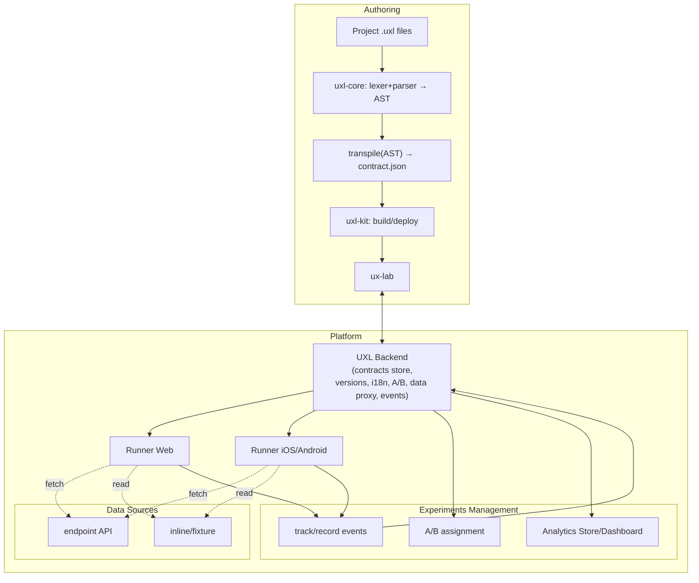

# UXL

**UXL** is a _User eXperience Lab_ and also the **UX eXperiment Language**: an experimental declarative language for describing user flows, screens, components, data, analytics, and A/B tests. 
Goal: let product teams quickly assemble interfaces, test hypotheses, and measure impact — all in one loop.

This repository is the **root** (navigator). The code currently lives in two separate repositories:
- [**uxl-core**](https://github.com/simplizio/uxl-core) — lexer, grammar, parser, minimal contract transpiler.
- [**uxl-kit**](https://github.com/simplizio/uxl-kit) — CLI utilities and the project build runner.
- [uxlab-studio](https://github.com/simplizio/uxlab-studio)
- [uxl-backend](https://github.com/simplizio/uxl-backend) 
- [uxl-runner-web](https://github.com/simplizio/uxl-runner-web)
- [uxl-runner-mobile](https://github.com/simplizio/uxl-runner-mobile)

> Add links to these repositories here after you publish them (see “Repositories” below).

---

## What’s already here

- **UXL language / grammar** (Nearley) and **indent-sensitive lexer**.
- **Parser** → a unified AST for `.uxl` files.
- **Simple transpiler** AST → “contract” (JSON) aggregating `screens`, `templates`, `data`, `i18n`, `ab`.
- **Project build** (in `uxl-kit`): recursive project loading from an entry point, `IMPORT` expansion, artifacts written to `dist/`.

Minimal UXL example:
```
data cart:
  inline:
    items:
      id: "p1", title: "T-Shirt", price: 25.0, qty: 2
      id: "p2",
        title: "Sneakers"
        price: 79.9
        qty: 1
    total: 129.9

data user:
  inline:
    isLoggedIn: false

screen Home:
  area content:
    component Row:
      component ProductList:
        bind:
          items: cart.items
      track view_home:
        total: cart.total
```


---

## What’s next

Near-term roadmap:

1. **Linking & resolution**: exports/includes, params, `use data`, normalizing `track` and `on` to a unified form.
2. **Rendering**: reference runtime (web/native), props & bind schema, data integration.
3. **A/B tests**: runtime support, allocation, tracking, variant consistency.
4. **Apps & tools**:
    - experiments and release-flow console
    - visual trace/event inspector
    - editor/Studio with syntax highlighting and snippets
5. **SDK** for integrating into existing apps.
6. **Documentation** and learning materials.

---

## Repositories

- `UXL` (this repo): overview, roadmap, links.
- `uxl-core`: grammar, lexer, parser, transpiler.
- `uxl-kit`: CLI and project builder.

> Replace with real GitHub links once the repos are public.

---

## Quick start (for developers)

The project is currently split into two active repos: **uxl-core** and **uxl-kit**.

1. **Install Node.js** (recommended ≥ 18).
2. Clone `uxl-core` and `uxl-kit`.
3. Install deps in both:
    `npm install`
4. Run the CLI from `uxl-kit` (globally via `npm link`, or directly with `node src/cli.js`).

CLI examples:

```bash
# Build the project from the default entry (uxl/main.uxl)
uxl build

# Emit both contract and AST
uxl build --emit contract,ast

# Lexer & parser debugging
uxl tokens uxl/main.uxl
uxl ast uxl/main.uxl --trace

```

Configure via `uxl.config.json` (CLI flags override it):
```json
{
  "entry": "uxl/main.uxl",
  "outDir": "dist",
  "emit": ["contract"],
  "baseIndent": 2,
  "tabWidth": 4,
  "strictIndent": false
}

```


Default build outputs:

```pgsql

dist/
  contract.json   # aggregated project contract
  ast.json        # (if --emit ast)

```

---

## Architecture at a glance
In UXL projects you declare: screen/component structure, data binding (endpoint/inline/fixture), localization (i18n), A/B variants, visibility rules (`when`), actions (`on: navigate/emit/record`), and events (`track`).

Then the rest of the stack kicks in:

- **Runners** (Web & Mobile) that render UIs from the contract.
- **Backend** that stores and serves the contract, assigns A/B variants, proxies/provides data, and ingests events.
- **Analytics** fed by backend from `track/record`.

# Architecture at a glance

- **uxl-core** — the language: lexer, parser (Nearley), AST; transpilation AST → contract (JSON).
- **uxl-kit** — project builder: loads all `.uxl` (with `IMPORT`), validates, and generates artifacts (`contract.json`, optional `ast.json`).
- **uxl-backend** _(planned)_ — contract/version store, i18n, A/B assignment, data proxy, event intake.
- **uxl-runner-web / uxl-runner-mobile** _(planned)_ — runtimes that:
    
    - pull the contract from backend,
    - render UI,
    - execute `when/on`,
    - load data,
    - send `track/record` back.
        
- **uxl-analytics** _(planned)_ — dashboards by A/B variant, screen, and event.



---

## Principles

- **Declarative**: less “how”, more “what”.
- **Transparent artifacts**: the build produces human-readable JSON contracts.
- **Incremental**: language and toolchain grow with needs — without unnecessary magic.
- **Observable**: tracing of events/navigation is part of the model, not a side effect.

---

## Roadmap (EN)

**Status legend:** ✅ done · 🔧 in progress · 🧭 planned

### 1) Language & Core

- ✅ Indent-sensitive lexer, Nearley grammar, parser 
- ✅ Basic transpiler → JSON “contract”
- 🔧 Project linker & resolver: `IMPORT`/`EXPORT`/`INCLUDE`, `PARAM`/`USE DATA`, i18n merge, normalization of `TRACK`/`ON`
- 🧭 Schema/type checks for `bind`/`props`, reference validation, better error messages
- 🧭 Sourcemaps and tracing (AST ↔ rendered UI)

### 2) Web Studio (code editor + live preview)

- 🔧 Web IDE (Monaco-based) with syntax highlighting, autocomplete, lint/diagnostics
- 🔧 Live preview/prototyper with hot-reload
- 🔧 A/B explorer: matrix of variants, side-by-side diff, quick switch across all combinations
- 🧭 Component tree & inspector, data inspector (actual values for `inline`/`endpoint`)
- 🧭 Event/track timeline and recorder
- 🧭 Templates/snippets, “Create from example”
- 🧭 Project graph view (imports/exports/includes)

### 3) Runtime & Renderers

- 🔧 Reference web renderer (React) with container/host API
- 🧭 Headless renderer for previews/screenshots/snapshots
- 🧭 Data adapters (inline/fixture/endpoint), caching & retries
- 🧭 Navigation engine (`navigate`, `back`, `pop_to`, `reset`, `tab`)
- 🧭 Runtime A/B assignment & consistency
- 🧭 Tracking hooks + pluggable sinks

### 4) Backend APIs & Services

- 🔧 Project/build registry, artifact storage
- 🧭 Experiment service (allocation, rollout rules, targeting)
- 🧭 Event ingestion gateway + connectors (GA4, Amplitude, Segment, webhooks)
- 🧭 Metrics compute (counters, funnels), exports to DW (parquet/CSV)
- 🧭 AuthN/Z, audit logs, environments (dev/stage/prod)

### 5) Analytics

- 🧭 Unified event schema & validation
- 🧭 Dashboards: funnels, retention, AB-reports by variant/cohort
- 🧭 Privacy: PII controls, sampling, TTL, deletion workflows

### 6) Runners & Tooling

- 🔧 CLI improvements (`uxl build/ast/tokens/inspect`)
- 🧭 Test runner (lint, schema check, snapshot tests)
- 🧭 CI recipes (GitHub Actions), `uxl init` scaffolding
- 🧭 Perf budget checks for renderers

### 7) Documentation & Examples

- 🔧 Language reference    
- 🧭 Tutorials (designer/dev/analyst flows)
- 🧭 Example apps and templates

---

## Contributing

- Propose changes via Issues and Pull Requests.
- Share minimal `.uxl` examples that break parsing or building.
- Help with tests, types, and docs.

> For local dev, it’s convenient to keep `uxl-core` and `uxl-kit` side by side and use `npm link` for the CLI.

---

## License

Project is licensed under Apache 2.0 license

---

## Contact

Add a link to discussions/chat or a contact for questions once the project opens up.